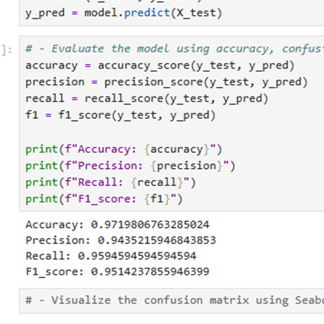
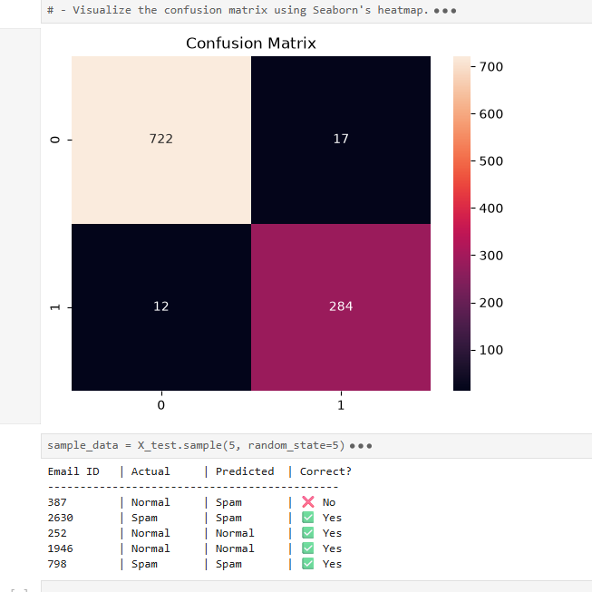

# 📧 Spam Detection using Logistic Regression

## 📌 Project Overview
This project builds a Machine Learning classifier to predict whether an incoming email is spam or normal. It utilizes a **Logistic Regression** model trained on features such as word frequencies and character patterns. The project also demonstrates best practices in model optimization, handling convergence warnings using gradient descent iterations, and project structuring.

## 🛠️ Technologies Used
* **Python**
* **Pandas & NumPy** (Data Preprocessing)
* **Scikit-Learn** (Model Training & Evaluation)
* **Seaborn & Matplotlib** (Data Visualization)

## 📊 Dataset
The dataset used in this project is the **Email Spam Classification Dataset**, which contains extracted features from emails (like the frequency of specific words and characters) and a binary target variable (1 = Spam, 0 = Normal).
* **Data Source:** [Kaggle - Email Spam Classification Dataset](https://www.kaggle.com/datasets/balaka18/email-spam-classification-dataset-csv)

## 🚀 Evaluation Metrics
The model was thoroughly evaluated using testing data and achieved excellent results:
* **Accuracy:** 97.2%
* **Precision:** 94.3%
* **Recall:** 95.9%
* **F1-Score:** 95.1%

## 📈 Confusion Matrix
To further analyze the model's performance and understand the rate of False Positives and False Negatives, a Confusion Matrix was plotted.

## 💡 How to Run Locally
1. Clone this repository: `git clone <your-repo-link>`
2. Create and activate a virtual environment.
3. Install dependencies: `pip install -r requirements.txt`
4. Run the Jupyter Notebook (`.ipynb` file) to train the model, or load the saved `.pkl` model using `joblib`.
